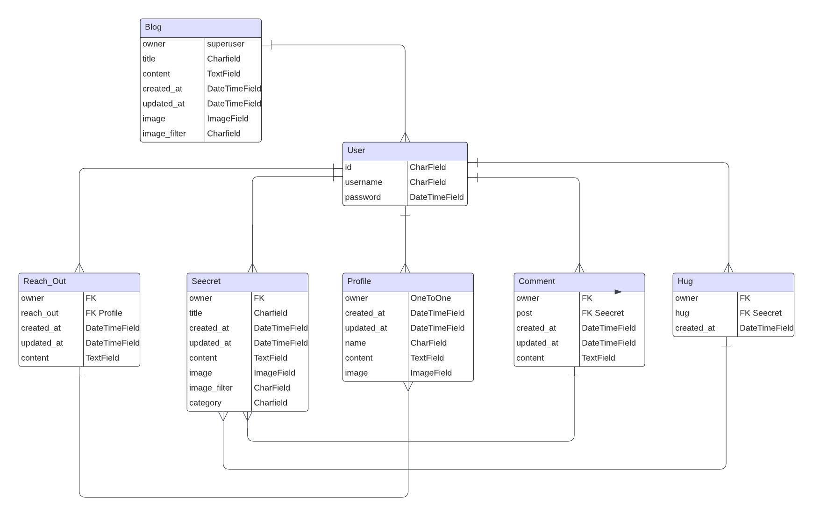
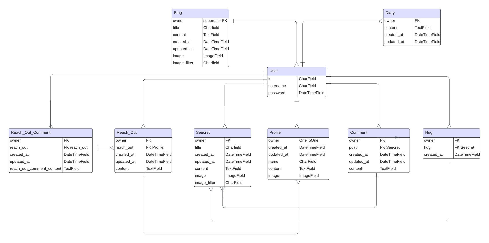

# [PP5API](https://seecrets-d488911dd03c.herokuapp.com)

[](https://github.com/EfthymiaKakoulidou/pp5api/commits/main)
[](https://github.com/EfthymiaKakoulidou/pp5api/commits/main)
[](https://github.com/EfthymiaKakoulidou/pp5api)

## Description

- PP5Api is the backend part of my final project at Code Institute for a Diploma in Full Stack Software Development. The project is a social media platform that has as a purpose to enable people to share their secrets with others, get support, contact eash other privately and write in their personal diaries. This api hosts the logic behind all this functionality.

- You can find the live deployed url here : https://seecrets-d488911dd03c.herokuapp.com/

- Deployed Frontend : https://secrets-276f7be740ae.herokuapp.com/

- Backend repository : https://github.com/EfthymiaKakoulidou/pp5api

- Frontend repository : https://github.com/EfthymiaKakoulidou/secrets

## Database Diagram

The initial ERD looked like this and it was much more simple than the final one.


Final ERD :


I realized I needed to implement separate models for my diary and the message functionality.

### Technologies used

- Languages Used

	- Python

- Frameworks, Libraries & Programs Used

- Databases Used

	- ElephantSQL

- Frameworks Used

	- Django Project - A framework to build the app.
	- Django REST Framework - A powerful and flexible toolkit for building Web APIs

- Libraries Used

	- Gunicorn - As the server for Heroku.
	- Dj_database_url - To parse the database URL from the environment variables in Heroku.
	- Psycopg2 - As an adaptor for Python and PostgreSQL databases.
	- Allauth - For authentication, registration, account management.
	- Cloudinary - To host images
	- django-filter - To create range filters
	- django-cors-headers - To allow in-browser requests to Django application from other origins.
	- django-phonenumber-field - To validate and convert phone numbers.
	- djangorestframework-simplejwt -provides a JSON Web Token authentication backend for the Django REST Framework.

- Programs Used

	- GitHub - To save and store files for the website.
	- GitPod - IDE used to create the site.

## Code Used

- Code Institute's walkthrough project.

## Deployment

### PostgreSQL Database

- This project uses a PostgreSQL database.
	- Log in to ElephantSQL.com to access your dashboard.
	- Click “Create New Instance”.
	- Set up your plan. Give your plan a Name (this is commonly the name of the project)
	- Select the Tiny Turtle (Free) plan
	- You can leave the Tags field blank.
	- Select “Select Region”.
	- Select a data center near you.
	- Check your details are correct and then click “Create instance”.


### Heroku Deployment

This project uses [Heroku](https://www.heroku.com), a platform as a service (PaaS) that enables developers to build, run, and operate applications entirely in the cloud.

Deployment steps are as follows, after account setup:

- Select **New** in the top-right corner of your Heroku Dashboard, and select **Create new app** from the dropdown menu.
- Your app name must be unique, and then choose a region closest to you (EU or USA), and finally, select **Create App**.
- From the new app **Settings**, click **Reveal Config Vars**, and set your environment variables.

> [!IMPORTANT]  
> This is a sample only; you would replace the values with your own if cloning/forking my repository.

| Key | Value |
| --- | --- |
| `ALLOWED_HOST` | user's own value |
| `DATABASE_URL` | user's own value |
| `DISABLE_COLLECTSTATIC` | 1 (*this is temporary, and can be removed for the final deployment*) |
| `SECRET_KEY` | user's own value |
| `CLIENT_ORIGIN` | user's own value |
| `CLIENT_ORIGIN_DEV` | user's own value |
| `CLOUDINARY_URL` | user's own value |


Heroku needs three additional files in order to deploy properly.

- requirements.txt
- Procfile

You can install this project's **requirements** (where applicable) using:

- `pip3 install -r requirements.txt`

If you have your own packages that have been installed, then the requirements file needs updated using:

- `pip3 freeze --local > requirements.txt`

The **Procfile** can be created with the following command:

- `echo web: gunicorn app_name.wsgi > Procfile`
- *replace **app_name** with the name of your primary Django app name; the folder where settings.py is located*

The **runtime.txt** file needs to know which Python version you're using:
1. type: `python3 --version` in the terminal.
2. in the **runtime.txt** file, add your Python version:
	- `python-3.9.18`

For Heroku deployment, follow these steps to connect your own GitHub repository to the newly created app:

Either:

- Select **Automatic Deployment** from the Heroku app.

Or:

- In the Terminal/CLI, connect to Heroku using this command: `heroku login -i`
- Set the remote for Heroku: `heroku git:remote -a app_name` (replace *app_name* with your app name)
- After performing the standard Git `add`, `commit`, and `push` to GitHub, you can now type:
	- `git push heroku main`

The project should now be connected and deployed to Heroku!

### Local Deployment

This project can be cloned or forked in order to make a local copy on your own system.

For either method, you will need to install any applicable packages found within the *requirements.txt* file.

- `pip3 install -r requirements.txt`.

You will need to create a new file called `env.py` at the root-level,
and include the same environment variables listed above from the Heroku deployment steps.

> [!IMPORTANT]  
> This is a sample only; you would replace the values with your own if cloning/forking my repository.

Sample `env.py` file:

```python

import os
os.environ['CLOUDINARY_URL'] = 'cloudinary:url'
os.environ['DEV'] = '1'
os.environ['DATABASE_URL'] = "postgres:url"
os.environ.setdefault("SECRET_KEY", "a secret key") 

# local environment only (do not include these in production/deployment!)
os.environ.setdefault("DEBUG", "True")
```

Once the project is cloned or forked, in order to run it locally, you'll need to follow these steps:

- Start the Django app: `python3 manage.py runserver`
- Stop the app once it's loaded: `CTRL+C` or `⌘+C` (Mac)
- Make any necessary migrations: `python3 manage.py makemigrations`
- Migrate the data to the database: `python3 manage.py migrate`
- Create a superuser: `python3 manage.py createsuperuser`
- Load fixtures (if applicable): `python3 manage.py loaddata file-name.json` (repeat for each file)
- Everything should be ready now, so run the Django app again: `python3 manage.py runserver`

If you'd like to backup your database models, use the following command for each model you'd like to create a fixture for:

- `python3 manage.py dumpdata your-model > your-model.json`
- *repeat this action for each model you wish to backup*

#### Cloning

You can clone the repository by following these steps:

1. Go to the [GitHub repository](https://github.com/EfthymiaKakoulidou/pp5api) 
2. Locate the Code button above the list of files and click it 
3. Select if you prefer to clone using HTTPS, SSH, or GitHub CLI and click the copy button to copy the URL to your clipboard
4. Open Git Bash or Terminal
5. Change the current working directory to the one where you want the cloned directory
6. In your IDE Terminal, type the following command to clone my repository:
	- `git clone https://github.com/EfthymiaKakoulidou/pp5api.git`
7. Press Enter to create your local clone.

Alternatively, if using Gitpod, you can click below to create your own workspace using this repository.

[](https://gitpod.io/#https://github.com/EfthymiaKakoulidou/pp5api)

Please note that in order to directly open the project in Gitpod, you need to have the browser extension installed.
A tutorial on how to do that can be found [here](https://www.gitpod.io/docs/configure/user-settings/browser-extension).

#### Forking

By forking the GitHub Repository, we make a copy of the original repository on our GitHub account to view and/or make changes without affecting the original owner's repository.
You can fork this repository by using the following steps:

1. Log in to GitHub and locate the [GitHub Repository](https://github.com/EfthymiaKakoulidou/pp5api)
2. At the top of the Repository (not top of page) just above the "Settings" Button on the menu, locate the "Fork" Button.
3. Once clicked, you should now have a copy of the original repository in your own GitHub account!


## Credits

I constructed this api with the guidance of code institute's walkthrough.


| Source | Location | Notes |
| --- | --- | --- |
| [Markdown Builder](https://tim.2bn.dev/markdown-builder) | README and TESTING | tool to help generate the Markdown files |
| [Django](https://www.djangoproject.com/) | Django | entire project |
| [ElephantSql](https://www.elephantsql.com/) | ElephantSQL | for the database |
| [CI Python Linter ](https://pep8ci.herokuapp.com/) | CI Python Linter | for the validation of .py files |


### Acknowledgements


- I would like to thank my Code Institute mentor, [Julia Konn] for her support throughout the development of this project.
- I would like to thank the [Code Institute](https://codeinstitute.net) tutor team for their assistance with troubleshooting and debugging some project issues.
- I would like to thank the [Code Institute Slack community](https://code-institute-room.slack.com) for the moral support; it kept me going during periods of self doubt and imposter syndrome.
- I would like to thank my partner, for supporting me to make this transition into software development.

