# Testing

> [!NOTE]  
> Return back to the [README.md](README.md) file.

## Code Validation

### Python

I have used the recommended [PEP8 CI Python Linter](https://pep8ci.herokuapp.com) to validate all of my Python files.

| Directory | File | CI URL | Screenshot | Notes |
| --- | --- | --- | --- | --- |
| blog | admin.py | [PEP8 CI](https://pep8ci.herokuapp.com/https://raw.githubusercontent.com/EfthymiaKakoulidou/pp5api/main/blog/admin.py) | 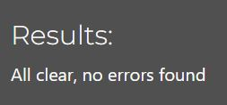 | |
| blog | models.py | [PEP8 CI](https://pep8ci.herokuapp.com/https://raw.githubusercontent.com/EfthymiaKakoulidou/pp5api/main/blog/models.py) | 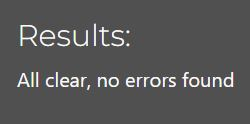 | |
| blog | serializers.py | [PEP8 CI](https://pep8ci.herokuapp.com/https://raw.githubusercontent.com/EfthymiaKakoulidou/pp5api/main/blog/serializers.py) | 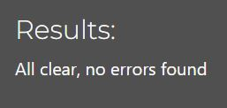 | |
| blog | urls.py | [PEP8 CI](https://pep8ci.herokuapp.com/https://raw.githubusercontent.com/EfthymiaKakoulidou/pp5api/main/blog/urls.py) | 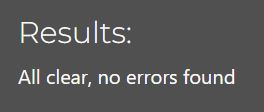 | |
| blog | views.py | [PEP8 CI](https://pep8ci.herokuapp.com/https://raw.githubusercontent.com/EfthymiaKakoulidou/pp5api/main/blog/views.py) | 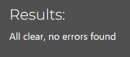 | |
| comments | admin.py | [PEP8 CI](https://pep8ci.herokuapp.com/https://raw.githubusercontent.com/EfthymiaKakoulidou/pp5api/main/comments/admin.py) |  | |
| comments | models.py | [PEP8 CI](https://pep8ci.herokuapp.com/https://raw.githubusercontent.com/EfthymiaKakoulidou/pp5api/main/comments/models.py) | 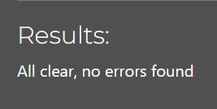 | |
| comments | serializers.py | [PEP8 CI](https://pep8ci.herokuapp.com/https://raw.githubusercontent.com/EfthymiaKakoulidou/pp5api/main/comments/serializers.py) |  | |
| comments | urls.py | [PEP8 CI](https://pep8ci.herokuapp.com/https://raw.githubusercontent.com/EfthymiaKakoulidou/pp5api/main/comments/urls.py) | 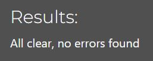 | |
| comments | views.py | [PEP8 CI](https://pep8ci.herokuapp.com/https://raw.githubusercontent.com/EfthymiaKakoulidou/pp5api/main/comments/views.py) | 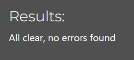 | |
| diary | admin.py | [PEP8 CI](https://pep8ci.herokuapp.com/https://raw.githubusercontent.com/EfthymiaKakoulidou/pp5api/main/diary/admin.py) | 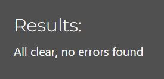 | |
| diary | models.py | [PEP8 CI](https://pep8ci.herokuapp.com/https://raw.githubusercontent.com/EfthymiaKakoulidou/pp5api/main/diary/models.py) |  | |
| diary | serializers.py | [PEP8 CI](https://pep8ci.herokuapp.com/https://raw.githubusercontent.com/EfthymiaKakoulidou/pp5api/main/diary/serializers.py) | 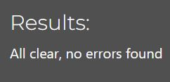 | |
| diary | urls.py | [PEP8 CI](https://pep8ci.herokuapp.com/https://raw.githubusercontent.com/EfthymiaKakoulidou/pp5api/main/diary/urls.py) |  | |
| diary | views.py | [PEP8 CI](https://pep8ci.herokuapp.com/https://raw.githubusercontent.com/EfthymiaKakoulidou/pp5api/main/diary/views.py) | 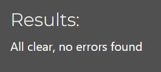 | |
| drf_api | permissions.py | [PEP8 CI](https://pep8ci.herokuapp.com/https://raw.githubusercontent.com/EfthymiaKakoulidou/pp5api/main/drf_api/permissions.py) | 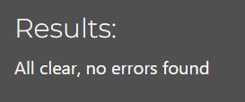 | |
| drf_api | serializers.py | [PEP8 CI](https://pep8ci.herokuapp.com/https://raw.githubusercontent.com/EfthymiaKakoulidou/pp5api/main/drf_api/serializers.py) | 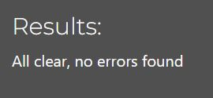 | |
| drf_api | settings.py | [PEP8 CI](https://pep8ci.herokuapp.com/https://raw.githubusercontent.com/EfthymiaKakoulidou/pp5api/main/drf_api/settings.py) | 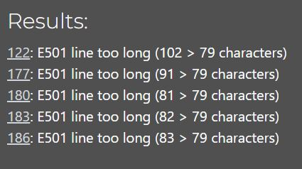 | |
| drf_api | urls.py | [PEP8 CI](https://pep8ci.herokuapp.com/https://raw.githubusercontent.com/EfthymiaKakoulidou/pp5api/main/drf_api/urls.py) | 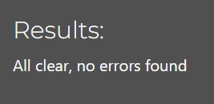 | |
| drf_api | views.py | [PEP8 CI](https://pep8ci.herokuapp.com/https://raw.githubusercontent.com/EfthymiaKakoulidou/pp5api/main/drf_api/views.py) | 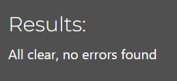 | |
| hugs | admin.py | [PEP8 CI](https://pep8ci.herokuapp.com/https://raw.githubusercontent.com/EfthymiaKakoulidou/pp5api/main/hugs/admin.py) |  | |
| hugs | models.py | [PEP8 CI](https://pep8ci.herokuapp.com/https://raw.githubusercontent.com/EfthymiaKakoulidou/pp5api/main/hugs/models.py) | 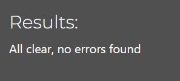 | |
| hugs | serializers.py | [PEP8 CI](https://pep8ci.herokuapp.com/https://raw.githubusercontent.com/EfthymiaKakoulidou/pp5api/main/hugs/serializers.py) |  | |
| hugs | urls.py | [PEP8 CI](https://pep8ci.herokuapp.com/https://raw.githubusercontent.com/EfthymiaKakoulidou/pp5api/main/hugs/urls.py) | 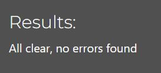 | |
| hugs | views.py | [PEP8 CI](https://pep8ci.herokuapp.com/https://raw.githubusercontent.com/EfthymiaKakoulidou/pp5api/main/hugs/views.py) | 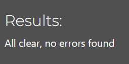 | |
|  | manage.py | [PEP8 CI](https://pep8ci.herokuapp.com/https://raw.githubusercontent.com/EfthymiaKakoulidou/pp5api/main/manage.py) |  | |
| profiles | admin.py | [PEP8 CI](https://pep8ci.herokuapp.com/https://raw.githubusercontent.com/EfthymiaKakoulidou/pp5api/main/profiles/admin.py) | 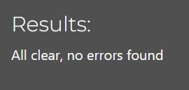 | |
| profiles | models.py | [PEP8 CI](https://pep8ci.herokuapp.com/https://raw.githubusercontent.com/EfthymiaKakoulidou/pp5api/main/profiles/models.py) | 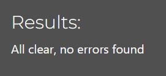 | |
| profiles | serializers.py | [PEP8 CI](https://pep8ci.herokuapp.com/https://raw.githubusercontent.com/EfthymiaKakoulidou/pp5api/main/profiles/serializers.py) | 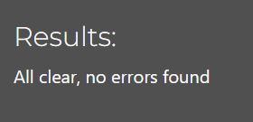 | |
| profiles | urls.py | [PEP8 CI](https://pep8ci.herokuapp.com/https://raw.githubusercontent.com/EfthymiaKakoulidou/pp5api/main/profiles/urls.py) | 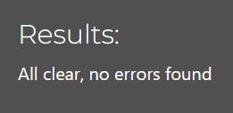 | |
| profiles | views.py | [PEP8 CI](https://pep8ci.herokuapp.com/https://raw.githubusercontent.com/EfthymiaKakoulidou/pp5api/main/profiles/views.py) |  | |
| reach_out | admin.py | [PEP8 CI](https://pep8ci.herokuapp.com/https://raw.githubusercontent.com/EfthymiaKakoulidou/pp5api/main/reach_out/admin.py) |  | |
| reach_out | models.py | [PEP8 CI](https://pep8ci.herokuapp.com/https://raw.githubusercontent.com/EfthymiaKakoulidou/pp5api/main/reach_out/models.py) | 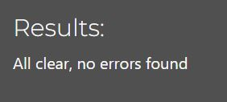 | |
| reach_out | serializers.py | [PEP8 CI](https://pep8ci.herokuapp.com/https://raw.githubusercontent.com/EfthymiaKakoulidou/pp5api/main/reach_out/serializers.py) |  | |
| reach_out | urls.py | [PEP8 CI](https://pep8ci.herokuapp.com/https://raw.githubusercontent.com/EfthymiaKakoulidou/pp5api/main/reach_out/urls.py) | 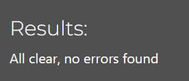 | |
| reach_out | views.py | [PEP8 CI](https://pep8ci.herokuapp.com/https://raw.githubusercontent.com/EfthymiaKakoulidou/pp5api/main/reach_out/views.py) |  | |
| reach_out_comments | admin.py | [PEP8 CI](https://pep8ci.herokuapp.com/https://raw.githubusercontent.com/EfthymiaKakoulidou/pp5api/main/reach_out_comments/admin.py) |  | |
| reach_out_comments | models.py | [PEP8 CI](https://pep8ci.herokuapp.com/https://raw.githubusercontent.com/EfthymiaKakoulidou/pp5api/main/reach_out_comments/models.py) | 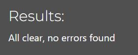 | |
| reach_out_comments | serializers.py | [PEP8 CI](https://pep8ci.herokuapp.com/https://raw.githubusercontent.com/EfthymiaKakoulidou/pp5api/main/reach_out_comments/serializers.py) | 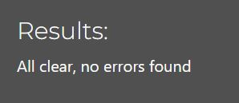 | |
| reach_out_comments | urls.py | [PEP8 CI](https://pep8ci.herokuapp.com/https://raw.githubusercontent.com/EfthymiaKakoulidou/pp5api/main/reach_out_comments/urls.py) | 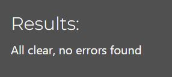 | |
| reach_out_comments | views.py | [PEP8 CI](https://pep8ci.herokuapp.com/https://raw.githubusercontent.com/EfthymiaKakoulidou/pp5api/main/reach_out_comments/views.py) | 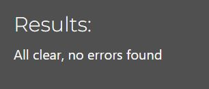 | |
| seecrets | admin.py | [PEP8 CI](https://pep8ci.herokuapp.com/https://raw.githubusercontent.com/EfthymiaKakoulidou/pp5api/main/seecrets/admin.py) |  | |
| seecrets | models.py | [PEP8 CI](https://pep8ci.herokuapp.com/https://raw.githubusercontent.com/EfthymiaKakoulidou/pp5api/main/seecrets/models.py) | 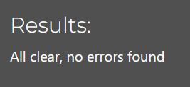 | |
| seecrets | serializers.py | [PEP8 CI](https://pep8ci.herokuapp.com/https://raw.githubusercontent.com/EfthymiaKakoulidou/pp5api/main/seecrets/serializers.py) |  | |
| seecrets | urls.py | [PEP8 CI](https://pep8ci.herokuapp.com/https://raw.githubusercontent.com/EfthymiaKakoulidou/pp5api/main/seecrets/urls.py) | 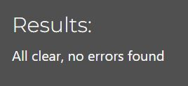 | |
| seecrets | views.py | [PEP8 CI](https://pep8ci.herokuapp.com/https://raw.githubusercontent.com/EfthymiaKakoulidou/pp5api/main/seecrets/views.py) |  | |

